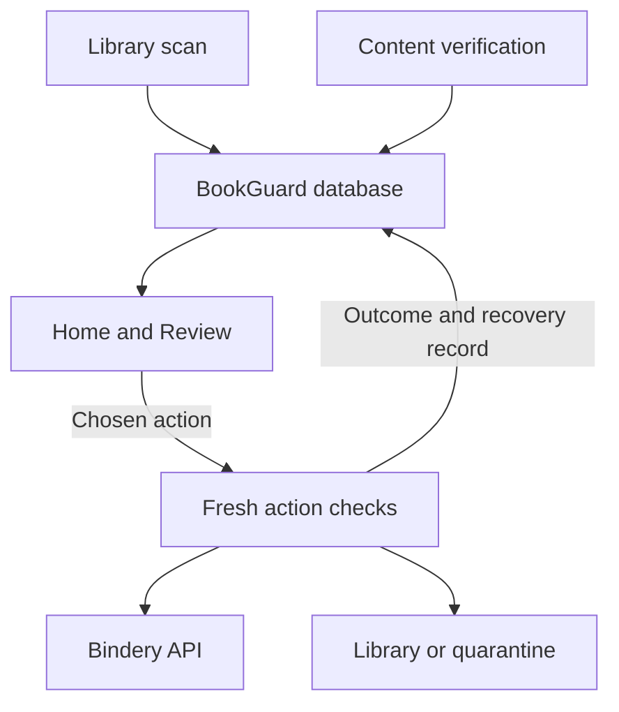

# Architecture

BookGuard is a FastAPI application with Jinja2 pages and small browser
controllers. It keeps its own SQLite journal and reads Bindery's database
through a read-only connection. Bindery API calls and media writes happen
through specific guarded workflows.

## How the pieces connect

The scan records an initial classification; content verification records a
separate verdict. Home and Review combine those records with resolution state.



The diagram shows responsibility and data flow, not automatic authorization.
Reading a page does not run an action. Import checks can add new scan results
and verification records. Observe produces recommendations; its legacy
`/api/automatic` routes do not execute them. Mutations use the individual
operator action paths and their current-state checks.

## Find the right module

| Responsibility | Entry points and supporting modules |
|---|---|
| Application startup | [`main.py`](../app/main.py): initialize journals, apply saved settings, start/stop the import watcher and scheduler |
| HTTP transport | [`routes/`](../app/routes/): parse requests, check confirmations and current results, invoke feature operations, and assemble responses |
| Library scan | [`scanner.py`](../app/scanner.py), [`matcher.py`](../app/matcher.py), [`metadata.py`](../app/metadata.py): read associations, inspect metadata, classify, and persist scan results |
| Shared title rules | [`title_matching.py`](../app/title_matching.py) owns normalization and number conflicts; [`series_titles.py`](../app/series_titles.py) derives catalogue variants without discarding work divisions. `matcher.py` retains author and audio identity rules and re-exports the common title API |
| Content verification | [`verifier.py`](../app/verifier.py) coordinates jobs, cached records, and verified repairs; [`verification_engine.py`](../app/verification_engine.py) classifies ebook identity |
| Evidence and byte safety | [`file_snapshot.py`](../app/file_snapshot.py), [`ebook_security.py`](../app/ebook_security.py), [`ebook_extraction.py`](../app/ebook_extraction.py), [`media_evidence.py`](../app/media_evidence.py), and audio/PDF/MOBI helpers |
| Read models and presentation | [`home.py`](../app/home.py), [`library_review.py`](../app/library_review.py), [`activity.py`](../app/activity.py), [`health.py`](../app/health.py), [`services/dashboard.py`](../app/services/dashboard.py), templates, and static controllers |
| Operator actions | [`triage.py`](../app/triage.py), [`actions.py`](../app/actions.py), [`repair.py`](../app/repair.py), [`catalogue_move.py`](../app/catalogue_move.py), [`replace.py`](../app/replace.py), and [`put_back.py`](../app/put_back.py) |
| New imports and maintenance | [`import_watch.py`](../app/import_watch.py), [`scheduler.py`](../app/scheduler.py), [`unmatched.py`](../app/unmatched.py), and [`duplicates.py`](../app/duplicates.py) |
| Observe and recovery planning | [`observe.py`](../app/observe.py), [`recovery_classifier.py`](../app/recovery_classifier.py), and [`recovery_planner.py`](../app/recovery_planner.py) |
| Integration and persistence | [`bindery_client.py`](../app/bindery_client.py), [`db.py`](../app/db.py), and feature-owned journal queries |
| Host operation and acceptance | [`tools/`](../tools/), [`scripts/`](../scripts/), and [`scripts/acceptance/`](../scripts/acceptance/) |

## Persistence and initialization

`/config/bookguard.db` contains BookGuard's application state. `db.py` owns
connections, the main schema, and many shared queries. Some features own
additional tables and initialization, including verification, review decisions,
import checks, scheduling, moves, and operational change records. Startup in
`main.py` initializes the required state before background services start.

| Records | What they represent |
|---|---|
| `scans`, `scan_results` | Library scan progress and initial file classifications |
| `content_verifications` | Content verdicts, confidence, fingerprints, and evidence |
| `triage_decisions` | Operator review decisions tied to a content signature |
| `metadata_repairs`, `cleanup_actions` | Applied/failed operations, Undo data, and eligible quarantine restoration records |
| `ebook_acquisitions`, `ebook_admissions` | Records from the removed self-download workflows, kept for Activity |
| `automation_observations`, `recovery_plans` | Observe decisions and proposed recovery steps |
| `automatic_executions` | Receipts from the removed Automatic Mode, kept for Activity and Attention |

Bindery's SQLite database is a separate read-only source. Supported registration,
monitoring, search, and queue changes use the Bindery client rather than direct
SQL writes to Bindery.

## Scan classification and verification verdict

These are different records and should not be treated as interchangeable:

- A library scan produces classifications such as `PASS`, `REVIEW`, `REJECT`,
  or `MISSING`.
- Content verification produces verdicts such as `VERIFIED_CORRECT`,
  `WRONG_CONTENT`, `METADATA_ERROR`, `UNSAFE_FILE`, or `INSUFFICIENT_EVIDENCE`.
- Review groups unresolved REVIEW/REJECT results using their latest verification
  and resolution state. A later verification does not silently rewrite the
  original scan classification.

`verification_status.py` identifies inconclusive scanner failures so they do
not become evidence for unsafe-file quarantine.

Cached verification has two identities: a reusable proof key covers the file
fingerprint, expected book, verifier version, and verification/matching policy;
a result suffix gives each scan result its own receipt. Reusing unchanged
evidence writes a receipt for the current result without moving the old scan's
record. Review and summaries can therefore find the proof by current result or
scan ID. Receipts carry the original verification ID and timestamp; Activity
shows actual verifications, excluding reuse receipts before applying feed
limits. Receipts remain stored with scan history; there is no automatic history
retention policy. Recorded ebook series names are part of the policy key and
are read once per verification, then used for both the key and classification.
An unavailable catalogue postpones ebook verification for that book (a batch
job continues and counts it as postponed); it does not mean a known empty
series list. Inconclusive scanner failures are not reused as
conclusive evidence.

Unmatched adoption checks identity across every discovered audio file, using
the shared whole-set title analyser. Unmatched applies an additional conservative
credit check: each track’s selected informative credit must support the expected author, whereas
audiobook verification can accept other author evidence when Artist names a
narrator. Placeholder credits are skipped in favour of the next credit field.
Generic chapter labels, including Prologue and Chapter One, do not prove another
work. Original volume and part designations are checked before shortened title
keys select an entry. Numeric, Roman, and English cardinal division labels are
equivalent (Part Five / Part V / Part 5). A bracketed `(Book N)` label is a series
position; `: Book N`, bare Part/Volume labels, and ambiguous named Part labels
remain work distinctions, as does a label with a total (`Volume One of Two`).
`(Book N of Series)` in brackets is a series position. Unknown division labels
(`Part Million`) require manual review; phrases that only begin with a label
(`Book Club Edition`, `Part of the … Series`) are not divisions.
Attach repeats these checks and reports changes to files, catalogue, or rules.

## The automation boundaries

BookGuard does not download, stage or publish files itself. Replace
([`replace.py`](../app/replace.py)) quarantines a bad file and hands the rest to
Bindery's own search through the API. Observe Mode
([`observe.py`](../app/observe.py)) only records what BookGuard would do. The
supervised Automatic Mode and its executors were removed;
`BOOKGUARD_AUTOMATION_MODE=automatic` is still accepted and behaves like
`manual`.

## Where to make a change

| Change | Start here | Relevant tests |
|---|---|---|
| Home counts or Review grouping/pagination | `home.py`, `library_review.py`, `routes/pages.py`, `templates/review.html` | `test_home_review.py`, `test_navigation.py` |
| Verification evidence or identity rules | `verification_engine.py` and the relevant evidence module | `test_verification_engine.py`, `test_isbn_evidence.py`, `test_malware_scan_inconclusive.py` |
| Quarantine and Put back | `triage.py`, `quarantine_fs.py`, `put_back.py`, `routes/triage.py` | `test_triage.py`, `test_quarantine_fs.py`, `test_put_back.py` |
| Settings and schedule behavior | `config.py`, `scheduler.py`, `routes/system.py` | `test_config.py`, `test_settings_persistence.py`, `test_system.py` |
| Runtime topology or upgrade checks | Compose overlays, host scripts, and `tools/upgrade_safety.py` | `test_upgrade_safety.py`, isolated smoke, and host deployment verification |

Routes remain the external API boundary. Existing cross-module helpers prefixed
with `_` are internal implementation dependencies; they are not a supported API
for external integrations. For larger changes, first identify the workflow's
fresh checks, external effect, journal, and restart-reconciliation behavior.

## Module inventory

BookGuard has one application entry point and separates HTTP transport from
domain behavior:

```text
app/main.py                 Application composition and startup
app/routes/                 Page and API routers grouped by feature
app/services/dashboard.py  Dashboard view-model assembly
app/scanner.py              Library scan orchestration
app/verifier.py             Verification jobs, persistence, and repairs
app/ebook_extraction.py     Ebook metadata and text extraction
app/ebook_security.py       Deterministic file-signature and structure validation
app/verification_engine.py  Ebook identity classification and safety rules
app/verification_constants.py Shared verification limits
app/observe.py              Non-mutating automation decision journal and policy
app/bindery_client.py       Bindery API and API-key discovery
app/file_safety.py          Shared filesystem hashing/safety helpers
app/no_replace.py           Atomic no-replace rename for quarantine and put back
app/media_evidence.py       Unified ebook/audiobook media evidence (E2)
app/audiobook_verification.py Audiobook identity and readability verification
app/recovery_classifier.py  Failure classification into recovery kinds
app/recovery_planner.py     Durable recovery plans and step definitions
app/quarantine_fs.py        Quarantine filesystem moves with verified cross-mount copies
app/catalogue_relationship.py How a misfiled ebook relates to the book it really is
app/catalogue_move.py       Guarded move of a misfiled ebook to the right book
app/attention.py            Attention queue assembly
app/home.py                 Read-only Home summary (health, decisions, activity)
app/activity.py             Activity timeline: plain sentences, who, result, filters
app/change_log.py           Records of setting changes and BookGuard starts/updates
app/import_watch.py         Checks each new Bindery import soon after it appears
app/health.py               System health checks with how-to-fix guidance
app/scheduler.py            Optional scheduled library scan and the task list
app/library_review.py       Open items grouped by the decision they need
app/put_back.py             Guarded restoration and Bindery follow-up for a Triage quarantine
app/replace.py              Review replacement handoff to Bindery's automatic search
app/unmatched.py            Evidence-based review of Bindery's unmatched imports
app/duplicates.py           Duplicate-entry evidence and exclusion of proven empty extras
app/attention_execution.py  Attention entries for interrupted automatic steps from older versions
app/operator_guidance.py    Read-only operator guidance for Attention items
tools/smoke_test.py         Isolated root-filesystem and Compose safety checks
tools/clamav_acceptance.py  Live ClamAV clean/EICAR acceptance test
scripts/smoke-test.sh       One-command containerized smoke-test runner
compose.clamav.yaml         Optional private ClamAV deployment overlay
templates/_layout.html      Shared header: Home, Review, Activity, System, Settings
static/home.js, review.js   Home and Review page controllers
static/triage-move.js       Move-to-correct-book UI controller
```

Versioned entry-point and verifier wrappers are intentionally avoided. New
behavior should be added to the relevant router or service and covered by a
focused test instead of layering another `main_v*` or `verifier_v*` module.
