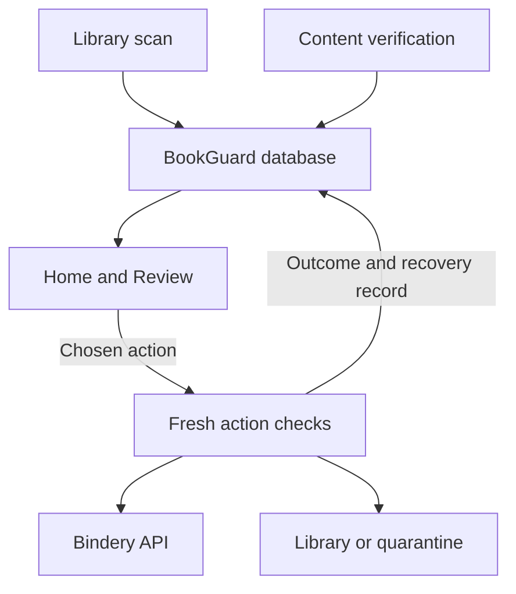

# Architecture

BookGuard is a FastAPI application with Jinja2 pages and small browser
controllers. It keeps its own SQLite journal and reads Bindery's database
through a read-only connection. Bindery API calls and media writes happen
through specific guarded workflows.

## How the pieces connect

The scan records an initial classification; content verification records a
separate verdict. Home and Review combine those records with resolution state.



The diagram shows responsibility and data flow, not automatic authorization.
Reading a page does not run an action. Import checks can add new scan results
and verification records; the supervised automation route uses a separate
allowlisted execution path.

## Find the right module

| Responsibility | Entry points and supporting modules |
|---|---|
| Application startup | [`main.py`](../app/main.py): initialize journals, apply saved settings, start/stop coordinator, import watcher, and scheduler |
| HTTP transport | [`routes/`](../app/routes/): parse requests, check confirmations and current results, invoke feature operations, and assemble responses |
| Library scan | [`scanner.py`](../app/scanner.py), [`matcher.py`](../app/matcher.py), [`metadata.py`](../app/metadata.py): read associations, inspect metadata, classify, and persist scan results |
| Content verification | [`verifier.py`](../app/verifier.py) coordinates jobs, cached records, and verified repairs; [`verification_engine.py`](../app/verification_engine.py) classifies ebook identity |
| Evidence and byte safety | [`file_snapshot.py`](../app/file_snapshot.py), [`ebook_security.py`](../app/ebook_security.py), [`ebook_extraction.py`](../app/ebook_extraction.py), [`media_evidence.py`](../app/media_evidence.py), and audio/PDF/MOBI helpers |
| Read models and presentation | [`home.py`](../app/home.py), [`library_review.py`](../app/library_review.py), [`activity.py`](../app/activity.py), [`health.py`](../app/health.py), [`services/dashboard.py`](../app/services/dashboard.py), templates, and static controllers |
| Operator actions | [`triage.py`](../app/triage.py), [`actions.py`](../app/actions.py), [`repair.py`](../app/repair.py), [`catalogue_move.py`](../app/catalogue_move.py), [`replace.py`](../app/replace.py), and [`put_back.py`](../app/put_back.py) |
| New imports and maintenance | [`import_watch.py`](../app/import_watch.py), [`scheduler.py`](../app/scheduler.py), [`unmatched.py`](../app/unmatched.py), and [`duplicates.py`](../app/duplicates.py) |
| Staged acquisition and publication | [`acquisition.py`](../app/acquisition.py), [`staging.py`](../app/staging.py), [`admission.py`](../app/admission.py), and acquisition/admission/publication helpers |
| Observe and recovery planning | [`observe.py`](../app/observe.py), [`recovery_classifier.py`](../app/recovery_classifier.py), and [`recovery_planner.py`](../app/recovery_planner.py) |
| Supervised automatic execution | [`automatic_runner.py`](../app/automatic_runner.py), [`automatic_execution.py`](../app/automatic_execution.py), [`automatic_contracts.py`](../app/automatic_contracts.py), and operation-specific executors |
| Integration and persistence | [`bindery_client.py`](../app/bindery_client.py), [`db.py`](../app/db.py), and feature-owned journal queries |
| Host operation and acceptance | [`tools/`](../tools/), [`scripts/`](../scripts/), and [`scripts/acceptance/`](../scripts/acceptance/) |

## Persistence and initialization

`/config/bookguard.db` contains BookGuard's application state. `db.py` owns
connections, the main schema, and many shared queries. Some features own
additional tables and initialization, including verification, review decisions,
import checks, scheduling, moves, and operational change records. Startup in
`main.py` initializes the required state before background services start.

| Records | What they represent |
|---|---|
| `scans`, `scan_results` | Library scan progress and initial file classifications |
| `content_verifications` | Content verdicts, confidence, fingerprints, and evidence |
| `triage_decisions` | Operator review decisions tied to a content signature |
| `metadata_repairs`, `cleanup_actions` | Applied/failed operations, Undo data, and eligible quarantine restoration records |
| `ebook_acquisitions`, `ebook_admissions` | Durable queue, staging, and publication workflows |
| `automation_observations`, `recovery_plans` | Observe decisions and proposed recovery steps |
| `automatic_executions` | Execution receipts and evidence for interrupted-effect reconciliation |

Bindery's SQLite database is a separate read-only source. Supported registration,
monitoring, search, and queue changes use the Bindery client rather than direct
SQL writes to Bindery.

## Scan classification and verification verdict

These are different records and should not be treated as interchangeable:

- A library scan produces classifications such as `PASS`, `REVIEW`, `REJECT`,
  or `MISSING`.
- Content verification produces verdicts such as `VERIFIED_CORRECT`,
  `WRONG_CONTENT`, `METADATA_ERROR`, `UNSAFE_FILE`, or `INSUFFICIENT_EVIDENCE`.
- Review groups unresolved REVIEW/REJECT results using their latest verification
  and resolution state. A later verification does not silently rewrite the
  original scan classification.

`verification_status.py` identifies inconclusive scanner failures so they do
not become evidence for unsafe-file quarantine.

## The automation boundaries

`automatic.py` contains guarded maintenance operations, including wrong-content
remediation. It is not the serialized E4 cycle entry point.

`automatic_runner.run_automatic_cycle()` is the serialized public cycle entry
used by the automation route. It dispatches to specialized workflow handlers
and the execution core. `automatic_execution.py` owns executor registration,
execution receipts, allowlisting, and step execution. Executor modules expose
their own revalidation and execution behavior.

Some executors register when `automatic_runner.py` is imported; core executors
register in `automatic_execution.py`. Keep that initialization in mind when
testing the execution-policy view. The supported action-code list, registered
executors, and deployment allowlist are distinct. Inspect the execution-policy
endpoint for the current intersection.

The acquisition coordinator is another mechanism: it resumes supported
operator-started workflows under its own opt-in gates. It does not select a
release or approve admission. See [advanced workflows](advanced-workflows.md).

## Where to make a change

| Change | Start here | Relevant tests |
|---|---|---|
| Home counts or Review grouping/pagination | `home.py`, `library_review.py`, `routes/pages.py`, `templates/review.html` | `test_home_review.py`, `test_navigation.py` |
| Verification evidence or identity rules | `verification_engine.py` and the relevant evidence module | `test_verification_engine.py`, `test_isbn_evidence.py`, `test_malware_scan_inconclusive.py` |
| Quarantine and Put back | `triage.py`, `quarantine_fs.py`, `put_back.py`, `routes/triage.py` | `test_triage.py`, `test_quarantine_fs.py`, `test_put_back.py` |
| Acquisition/admission or interrupted recovery | The corresponding feature module and its executor | Feature unit tests plus the matching acceptance scenario |
| Settings and schedule behavior | `config.py`, `scheduler.py`, `routes/system.py` | `test_config.py`, `test_settings_persistence.py`, `test_system.py` |
| Runtime topology or upgrade checks | Compose overlays, host scripts, and `tools/upgrade_safety.py` | `test_upgrade_safety.py`, isolated smoke, and host deployment verification |

Routes remain the external API boundary. Existing cross-module helpers prefixed
with `_` are internal implementation dependencies; they are not a supported API
for external integrations. For larger changes, first identify the workflow's
fresh checks, external effect, journal, and restart-reconciliation behavior.

## Module inventory

BookGuard has one application entry point and separates HTTP transport from
domain behavior:

```text
app/main.py                 Application composition and startup
app/routes/                 Page and API routers grouped by feature
app/services/dashboard.py  Dashboard view-model assembly
app/scanner.py              Library scan orchestration
app/verifier.py             Verification jobs, persistence, and repairs
app/ebook_extraction.py     Ebook metadata and text extraction
app/ebook_security.py       Deterministic file-signature and structure validation
app/verification_engine.py  Ebook identity classification and safety rules
app/verification_constants.py Shared verification limits
app/staging.py              Read-only staged-byte verification
app/admission.py            Atomic direct-admission transaction and recovery
app/acquisition.py          One-at-a-time Bindery queue-to-staging workflow
app/acquisition_coordinator.py Restart-safe supervised workflow advancement
app/acquisition_progress.py Supervised known-queue staging progression
app/observe.py              Non-mutating automation decision journal and policy
app/automatic.py            Guarded automatic-maintenance workflow
app/bindery_client.py       Bindery API and API-key discovery
app/file_safety.py          Shared filesystem hashing/safety helpers
app/no_replace.py           Atomic no-replace rename for publication and quarantine
app/media_evidence.py       Unified ebook/audiobook media evidence (E2)
app/audiobook_verification.py Audiobook identity and readability verification
app/recovery_classifier.py  Failure classification into recovery kinds
app/recovery_planner.py     Durable recovery plans and step definitions
app/automatic_execution.py  E4 execution journal, allowlist, and one-step executor
app/automatic_contracts.py  Shared E4 execution policy types
app/automatic_runner.py     Serialized E4 cycle dispatch and guarded finalization
app/acquisition_admission_*.py Verified-acquisition admission preflight, execution, and scan
app/admission_prepublication_review.py Proof for admissions that failed before publication
app/prepublication_retirement.py Retirement of one proven pre-publication failure
app/publication_*.py        Publication proof, recovery, and registration scan
app/registration_correction.py E4 registration-conflict correction executor
app/automatic_alternate.py  Operator-selected alternate grab executor
app/alternate_*.py          Alternate candidate review and durable operator selection
app/automatic_quarantine*.py Unsafe-media quarantine and post-quarantine grab
app/quarantine_*.py         Quarantine filesystem moves, selection, handoff, and final-state proof
app/catalogue_relationship.py How a misfiled ebook relates to the book it really is
app/catalogue_move.py       Guarded move of a misfiled ebook to the right book
app/attention.py            Attention queue assembly
app/home.py                 Read-only Home summary (health, decisions, activity)
app/activity.py             Activity timeline: plain sentences, who, result, filters
app/change_log.py           Records of setting changes and BookGuard starts/updates
app/import_watch.py         Checks each new Bindery import soon after it appears
app/health.py               System health checks with how-to-fix guidance
app/scheduler.py            Optional scheduled library scan and the task list
app/library_review.py       Open items grouped by the decision they need
app/put_back.py             Guarded restoration and Bindery follow-up for a Triage quarantine
app/replace.py              Review replacement handoff to Bindery's automatic search
app/unmatched.py            Evidence-based review of Bindery's unmatched imports
app/duplicates.py           Duplicate-entry evidence and exclusion of proven empty extras
app/attention_execution.py  Attention entries for interrupted E4 receipts
app/operator_guidance.py    Read-only operator guidance for Attention items
tools/smoke_test.py         Isolated workflow and Compose safety harness
tools/clamav_acceptance.py  Live ClamAV clean/EICAR acceptance test
scripts/smoke-test.sh       One-command containerized smoke-test runner
compose.clamav.yaml         Optional private ClamAV deployment overlay
templates/_layout.html      Shared header: Home, Review, Activity, System, Settings
static/home.js, review.js   Home and Review page controllers
static/triage-acquisition.js Supervised replacement UI controller
static/triage-move.js       Move-to-correct-book UI controller
```

Versioned entry-point and verifier wrappers are intentionally avoided. New
behavior should be added to the relevant router or service and covered by a
focused test instead of layering another `main_v*` or `verifier_v*` module.
